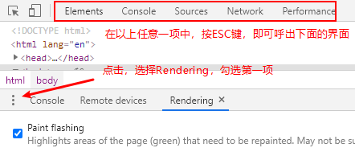
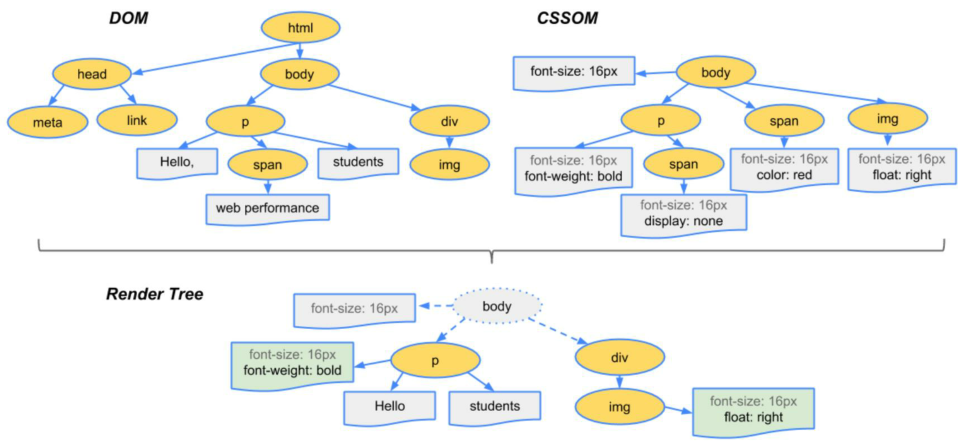
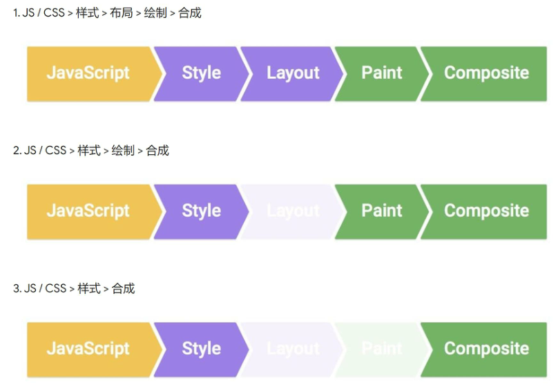

## CSS动画小结

### 动画的定义  
> 动画就是由有许多静止的图片/画面（帧）以一定的速度，如每秒30张连续播放时，肉眼因视觉残象产生错觉，误以为是活动的画面。

#### 什么是帧？
> 动画中每个静止的图片/画面都叫做帧

#### 一个简单的例子
将div从左往右移动：[效果预览](https://gjy80230.github.io/SmallDemo/removeRight.html)
[代码查看](https://github.com/Gjy80230/SmallDemo/blob/09278e5155a5691b7cc2d10b3f8cfb4019ebe04c/removeRight.html)  
这个简单动画的原理是我们用[setinterval](https://developer.mozilla.org/zh-CN/docs/Web/API/Window/setInterval)来把一个div移动一小段距离直到目标地点。 

### 查看渲染过程
我们需要打开浏览器的开发者工具，打开渲染，如下图所示。  
  
做完以上步骤，当你用它来查看动画运行时，屏幕就会闪过绿色。

说明：  
* 绿色表示重新绘制（repaint）了
* CSS渲染过程依次包含布局、绘制、合成
* 其中布局和绘制这两个过程有可能被省略

既然我们都说到渲染过程了，那浏览器的渲染源原理呢？

## 浏览器渲染原理
[谷歌团队的文章](https://developers.google.com/web/fundamentals/performance/critical-rendering-path/render-tree-construction)，有兴趣可以看下，TL;DR。我们可以说下大概的步骤。

#### 步骤
* 根据HTML构建HTML树（DOM）
* 根据CSS构建CSS树（CSSOM）
* 将两棵树合并成一颗渲染树（render tree）
* Layout/布局（文档流、盒模型、计算大小和位置）
* Paint/绘制（把边框颜色、文字颜色、阴影等画出来）
* Compose/合成（根据层叠关系展示画面）
  
   

### 更新方式
当我们第一次渲染完成之后，需要进行样式的更新，样式的更新需要什么过程呢？  

用JS来更新样式  
* 比如div.style.background='red'
* 比如 div.style.display='none'
* 比如div.classList.add（'red’）
* 比如div.remove（）直接删掉节点

#### 三种更新方式
上面的方法有三种不同的渲染方式  
  

* [第一种](http://js.jirengu.com/jagel/1)，全部走一遍
    * div.remove( ）会触发当前消失，其他元素relayout
* [第二种](http://js.jirengu.com/jidam/1)，跳过layout
    * 改变背景颜色，直接repaint+composite
* [第三种](http://js.jirengu.com/wusew/1)，跳过layout和paint
    * 改变transform，只需composite
    * 注意必须全屏查看效果，在iframe里看有问题

#### 怎么知道对应的触发过程
还好，已经有前辈帮你整理好了每个属性它会触发什么过程：[CSSTriggers](https://csstriggers.com/)

不过当我们用[CSSTriggers](https://csstriggers.com/)来查看将div从左往右移动的例子时，你会发现它从开始到结束都是在重新绘制的，这样就会造成资源的极大浪费。  

#### 优化
我们可以把上面的例子改为用[transition](https://developer.mozilla.org/zh-CN/docs/Web/CSS/transition)结合[transform](https://developer.mozilla.org/zh-CN/docs/Web/CSS/transform)来做，它只会在开始和结束的时候进行绘制，这样就很节省资源。  
[代码](https://github.com/Gjy80230/SmallDemo/blob/master/removeRight.html)

## CSS动画的两种做法
#### 跳动的心
transition结合transform版：[代码查看](https://github.com/Gjy80230/SmallDemo/blob/master/BeatingHeart/bHTT.html) [效果预览](https://gjy80230.github.io/SmallDemo/BeatingHeart/bHTT.html) 

animation版：[代码查看](https://github.com/Gjy80230/SmallDemo/blob/master/BeatingHeart/bHA.html) [效果预览](https://gjy80230.github.io/SmallDemo/BeatingHeart/bHA.html) 

transition结合transform版要hover到心上去，才会变大，移开变小。  
而animation版使用了infinite，可以不停的跳动。

