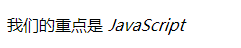

## HTML 入门笔记 1

最近了解了 HTML，所以来记录一下，可以日后复习。

### HTML 是谁发明的

HTML 当然是[李爵士(Timothy John Berners-Lee)](https://zh.wikipedia.org/zh/%E8%92%82%E5%A7%86%C2%B7%E4%BC%AF%E7%BA%B3%E6%96%AF-%E6%9D%8E)发明的。同时他还发明了万维网（World Wide Web）、HTTP 和 URL。

### HTML 首先应该写什么

我们写一个 HTML 页面，一般都是会先写以下的内容：

```html
<!DOCTYPE html>
<!--这是文档类型，表示html -->
<html lang="en">
  <!--这是用什么语言，en为英文，改为zh-CN -->
  <!--html标签有两个子元素：head和body -->
  <head>
    <!--head标签除了有meta、title标签，一般还会有script、style标签 -->
    <meta charset="UTF-8" />
    <!--这是文件的编码方式-->
    <meta name="viewport" content="width=device-width, initial-scale=1.0" />
    <!--表示禁用缩放，兼容手机 -->
    <title>My Page</title>
    <!--浏览器打开时，网页的标题-->
  </head>
  <!--下面就是网页的内容了-->
  <body></body>
</html>
```

### 常用表示的章节标签

我们来看下 body 标签里面有什么

**标题 h1~h6**
> 用于表示标题、副标题。

**章节 section**
> 用于表示章节，也可以 section 中套 section。

**段落 p**
> 当需要输入文本内容的时候，这个标签就体现了它的作用，哪怕是一句话，也可以用 p 标签。

**文章 article**
> 代表一个在文档、页面或者网站中自成一体的内容。一般一个article中会有header、footer以及主要内容。

**头部 header**
> 有时候需要加点广告之类的，可以用这个标签。

**脚部 footer**
> 一般用于版权声明或者其他声明，像我们浏览的很多网站都是有声明的，就是用的这个标签。


**主要内容 main**
> 当我们的结构有头部、有尾部，我们可以把主要的内容标记出来。

**旁支内容 aside**
> 一般用于写导航，或者次要的内容。

**划分 div**
> 一般用于划分网页的结构。

### 全局属性有哪些

**类 class**

- 给一个标签写一个类，一般的使用方法是先在标签中写一个 class，再给 class 一个名字，之后在 style 标签中引用它并给它相应的样式。
  

- 给 class 样式有两种写法，不过第一种写法当有 2 个以上 class 的时候，必须全部都写上去。而第二种只需要写其中一个就可以了。


上图，两种写法都是可以的，不过推荐第二种写法，比较方便。

**contenteditable**
> 可以在网页中编辑任何一个元素。

**hidden**
> 当你在某个元素写上这个属性，这个元素将会在网页中消失。

**id**
- 不到万不得已，千万不要用。id 是用来表示全局唯一的标签，但是 id 的全局唯一性没有保障，就算有两个重复的 id，HTML 也不会提示我写错了。
- 使用方法：
  1. css：一般给元素写上 id="xx"，在 style 标签中给它添加样式时用#xx{style}引用。
  2. js：用于获取 id。
  3. 不要是已经存在的关键字。如 window 所有的属性。

**style**
> 用于给网页添加CSS样式的标签。有三种写法，以后再说。

**tabindex**
> 当元素有这个属性时，可以用tab 键进行交互。

- tabindex=1；也就是正数，表示可以被tab 访问。
- tabindex 可以是 0，表示最后才被 tab 访问。
- tabindex 可以是负数，表示不可被 tab 访问。

**title**
> 当你省略了之后，title 属性放入完整的内容，就可以通过鼠标悬浮在省略的文字上显示出来。


### 常用的内容标签
**ol+li（ordered list +list item）**
> 有序列表，当你用这个列表时，它的每一项开头都会有一个数字，这个数字从1开始一次递增。

**ul+li（unordered list +listitem）**
> 无序列表。每一项的开头都是用“·”进行标记。
当然有序列表和无序列表的样式都是可以通过css清除的。
```html
<ol>
       <li>前端</li>
       <li>中间件</li>
       <li>后端</li>
</ol>

<ul>
       <li>前端</li>
       <li>中间件</li>
       <li>后端</li>
</ul>
```
效果如下：


**dl+dt+dd（description list +term + data）**
> 描述列表，用于描述一些事物。
```html
<dl>
        <dt>GROUP A</dt>
        <dd>G2 ESPORTS</dd>
        <dd>SUNING</dd>
        <dd>MACHI ESPORTS</dd>
        <dd>ETAM LIQUID</dd>
</dl>
<dl>
        <dt>GROUP B</dt>
        <dd>DAMWON GAMING</dd>
        <dd>JD GAMING</dd>
        <dd>ROGUE</dd>
        <dd>PSG TALON</dd>
</dl>
```
效果如下：


**pre（preview的缩写）**
> 能让你的代码按照你想要的样子呈现，如保留空格、缩进、回车。
```html
<pre>
<h3>用最真诚的方式，
谱写东方的超级英雄史诗。</h3>
<p>我们的野心，不只是去重新塑造一个个大主角。而是用顶尖的感面，丰等的细节，沉浸的战斗体验，足量的剧情演
绎，去还原我们心中一直存在的那个来方魔幻世界——
她是如此辽阔、狂野、浪漫、充满想象力与神秘感，又无此真实可信。</p>
</pre>
```
效果如下：


**hr**
> 一条分隔线。

**br（break的缩写）**
> 添加一个回车。

**a（anchor的缩写）**
> 锚点，用于跳转网页。
```html
<a href="http://zhihu.com">编乎</a>
```

**em（emphasis的缩写）**
> 表示强调。
```html
我们的重点是<em> JavaScript </em>
```
效果如下：



**strong**
> 加粗文字。
```html
我们的<strong>重点</strong>是<em> JavaScript </em>
```
效果如下：


**code**
> 把代码包起来，以代码的形式呈现；
但是不会换行，可以用per包裹来达到换行的效果。

**q（quote的缩写）**
> 引用文字，被包裹的文字不会换行。

**blockquote**
> 引用文字，被包裹的文字会换行。