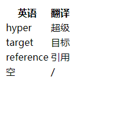

## HTML常用标签
继上次入门了HTML，这次学习了一些常用的标签，下面是它们的具体用法。

### a标签
**属性**
- href（超链接）
- target
- download
- rel=noopener  防止一个bug

**作用**
- 跳转外部页面
- 跳转内部锚点
- 跳转到邮箱或电话...

#### a标签的href属性
**网址**
- https://baidu.com
- http://baidu.com
- //baidu.com  最高级写法，自动使用http或者https写法。

```html
<a href="//baidu.com">baidu</a>
```
**路径**
- /a/b/c 以及 a/b/c
     - /a/b/c会把当前http.server所在路径当成根目录加上/a/b/c打开c文件
     - a/b/c相对路径打开
- index.html 以及 ./index.html 两个是一样的

```html
<a href="/a/s/d.html">D.html</a>       //根目录打开

<a href="a/s/f.html">f.html</a>     //相对路径打开
```
我们把http服务的链接复制到空白的地方，可以看到：


但是你如果用ftp协议去打开第一种写法的d.html，那么就是这样的：

同时它的链接是这样的：


不过用ftp协议打开相对路径的页面，则是正常的。

**伪协议**
- javascript:代码;
- mailto:邮箱
- tel:手机号

```html
<a href="javascript:alert(1);">javascript伪协议</a>    //点击弹窗
<a href="javascript: ;">无动作</a>   //点击之后无动作
<a href="#xxx">查看xxx</a>    //点击之后跳转到指定的标签 
```

**id**
- href=#xxx

#### a标签的target属性
**常用属性值**
- _blank  新窗口打开
- _top  最顶层窗口打开
- _parent  父级窗口打开
- _self  自身窗口打开

**name的联动**
- window的name
    - target=xxx的窗口，如果当前没有就会新开一个窗口，两个target=xxx的窗口同时打开，那么第二个打开的xxx窗口会覆盖前一个xxx的窗口。
- iframe的name
    - 通过与a标签的target属性值相同来进行联动，点击target属性值，对应的iframe窗口就会跳转。

#### a标签的download属性
> 点击可以用于下载

### img标签
#### 作用
> 发出get请求，展示一张图片。

#### 属性
**alt**
> 当图片错误无法显示时，alt的值会代替图片显示。

**height**
> img标签自带的属性，可以设置高度。

**width**
> 用于设置宽度，当只写了宽度时，高度会自适应。

**src**
> 图片的地址

```html

```
如果设置了宽度的同时还设置了高度，那么图片将会被拉伸变形。

#### 事件
img标签有两个用于监听图片是否成功加载的事件，可以在图片加载失败的时候进行挽救。

**onload**
> 图片加载成功。

**onerror**
> 图片加载失败。

```js
pic.onload = function () {
     console.log("图片加载成功");
};
pic.onerror = function () {
     console.log("图片加载失败");
};
```

#### 响应式
> 图片自动适应网页

```css
img {
        max-width: 100%;
      }
```

### table标签
#### 相关标签
- table
- thead
- tbody
- tfoot
- tr（table row 表中的一行）
- td（table data 表中的数据）
- th（table head 表头）

1. 只有一行表头
```html
<table>
      <thead>
        <tr>
          <th>英语</th>
          <th>翻译</th>
        </tr>
      </thead>
      <tbody>
        <tr>
          <td>hyper</td>
          <td>超级</td>
        </tr>
        <tr>
          <td>target</td>
          <td>目标</td>
        </tr>
        <tr>
          <td>reference</td>
          <td>引用</td>
        </tr>
      </tbody>
      <tfoot>
        <tr>
          <td>空</td>
          <td>/</td>
        </tr>
      </tfoot>
    </table>
```
效果：

2. 两行表头
```html
<table>
      <thead>
        <tr>
          <th></th>
          <th>小红</th>
          <th>小明</th>
          <th>小强</th>
        </tr>
      </thead>
      <tbody>
        <tr>
          <th>数学</th>
          <td>61</td>
          <td>91</td>
          <td>85</td>
        </tr>
        <tr>
          <th>语文</th>
          <td>79</td>
          <td>82</td>
          <td>92</td>
        </tr>
        <tr>
          <th>英语</th>
          <td>100</td>
          <td>97</td>
          <td>87</td>
        </tr>
      </tbody>
      <tfoot>
        <tr>
          <th>总分</th>
          <td>200</td>
          <td>179</td>
          <td>190</td>
        </tr>
      </tfoot>
    </table>
```
效果：

3. 浏览器纠错
- 当你忘记写了thead、tbody、tfoot标签，写好的tr会变成tbody里面的内容，如果只写了td，浏览器会帮你加上tr，渲染在页面上也会是完整的表格。

4. thead、tbody、tfoot的顺序
- 它们的顺序是按照thead、tbody、tfoot来排列的，无论你把它们怎么颠倒，依然是这个顺序。

#### 相关样式
**table-layout**
> CSS属性定义了用于布局表格单元格，行和列的算法。

值：
- auto（默认值）
    - 表格中字数较多的一列相比于字数较少的一列，会获得更多的宽度。
- fixed
    - 表格中所有列无论字数多少，宽度都是均匀的。

**border-spacing**
> 指定相邻单元格边框之间的距离，默认是不合并。

```css
table {
        width: 420px;
        table-layout: fixed;
        border-spacing: 10px 20px;  //也可以一个值
      }      
 th,
      td {
        border: 1px solid burlywood;
      }
```
效果：


**border-collapse**
> 用来决定表格的边框是分开还是合并的。

```css
table {
        width: 420px;
        table-layout: fixed;
        border-spacing: 0px;
        border-collapse: collapse;
      }
      th,
      td {
        border: 1px solid burlywood;
      }
```
上面的border-spacing可以不写或者为0px；

效果：


### 总结
以前学习这些标签的时候只能写出基本的功能，勉强能用！今天算是深入的学习了，发现原来这么有趣还让人感到惊喜。
其实常用的标签还有很多，像form标签、textarea标签、select标签等等，之后的笔记都会写上，这里先挖个坑~
